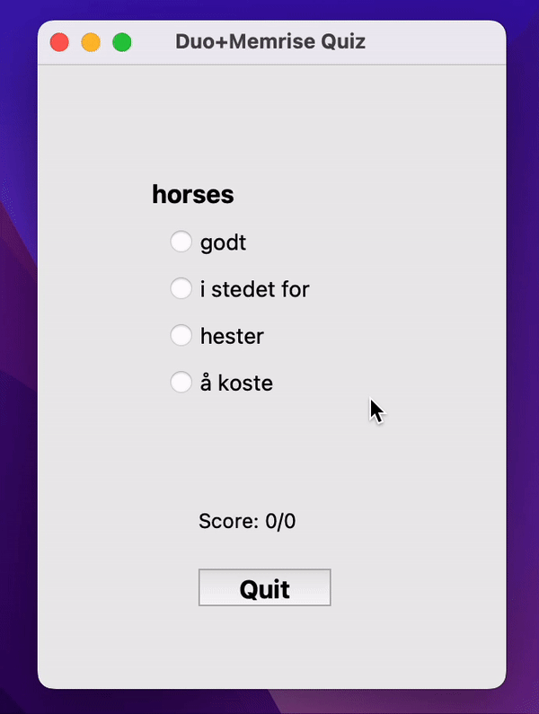

# norsk

Sterke verb: 

Duolingo + Memrise: 
- Multiple choice (no gui): 
- Multiple choice (gui): duo-mem-mcc.py - has to be run locally, e.g.:  *python duo-mem-mcc.py n* where n is the number of questions you want in a quiz (integer).
- Type answer in: 

